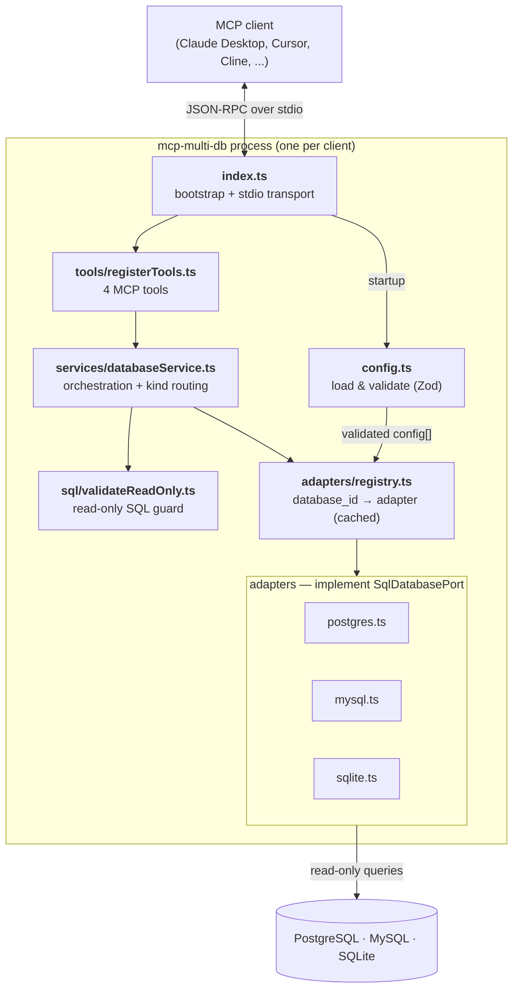
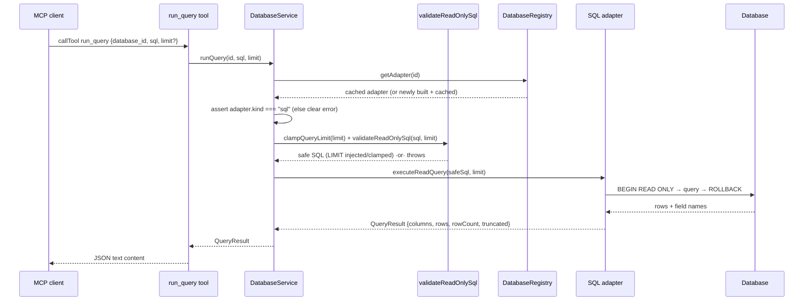
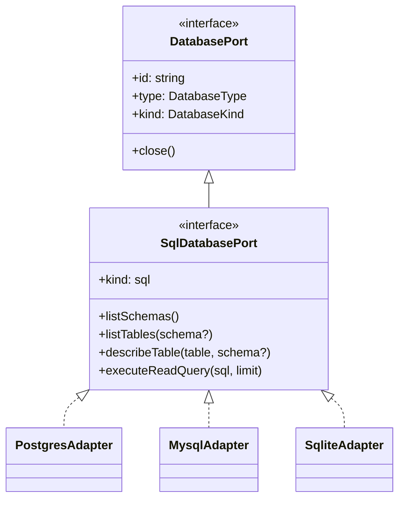
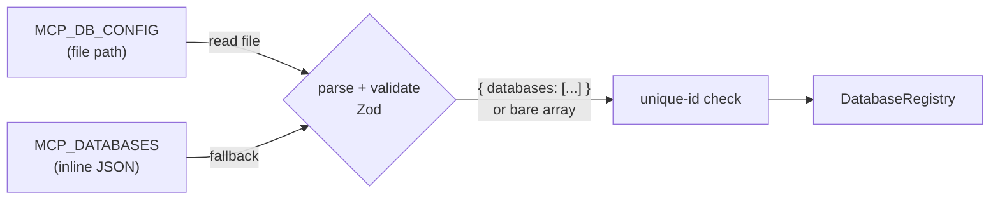

# Architecture

This document explains the components of `mcp-multi-db`, what each is
responsible for, and how a request flows through them. For setup see the
[README](../README.md); for the read-only safety model see
[SECURITY.md](../SECURITY.md); for adding a database see
[extending.md](extending.md).

## What it is, in one paragraph

`mcp-multi-db` is a single [Model Context Protocol](https://modelcontextprotocol.io)
server, spoken over **stdio**, that lets an AI agent run **read-only** SQL
against several databases at once. You declare your databases in one config
file; the agent discovers them and queries any of them by `database_id`. Every
query is forced read-only — both by inspecting the SQL text and by the database
connection itself — so it is safe to point at real data.

## The big picture

The server is layered. Each layer has one job and talks only to its neighbours,
which is what keeps the SQL engines interchangeable and leaves room for non-SQL
engines later.

## Components and responsibilities

| Component | File | Responsibility |
|-----------|------|----------------|
| **Entry point** | [`src/index.ts`](../src/index.ts) | Bootstraps the process: loads config, builds the registry/service, registers tools, and connects the stdio transport. |
| **Config loader** | [`src/config.ts`](../src/config.ts) | Reads and validates the database list (Zod). Resolves `MCP_DB_CONFIG` (a file path) or `MCP_DATABASES` (inline JSON); enforces unique ids. |
| **Tool layer** | [`src/tools/registerTools.ts`](../src/tools/registerTools.ts) | Declares the 4 MCP tools and their Zod input schemas. Each tool is a thin wrapper: call the service, JSON-stringify the result into a text content block. |
| **Service** | [`src/services/databaseService.ts`](../src/services/databaseService.ts) | Orchestration. Resolves an adapter, **narrows it to the right family** (`getSqlAdapter`), runs the read-only guard, and dispatches to the adapter. The only place the SQL guard runs. |
| **Read-only guard** | [`src/sql/validateReadOnly.ts`](../src/sql/validateReadOnly.ts) | Pure functions: allow/deny SQL by text, reject multiple statements, inject/clamp `LIMIT`. |
| **Registry** | [`src/adapters/registry.ts`](../src/adapters/registry.ts) | Maps `database_id` → adapter instance. Lazily constructs adapters (and their connection pools) on first use and **caches** them; closes them all on shutdown. |
| **Adapters** | [`src/adapters/{postgres,mysql,sqlite}.ts`](../src/adapters/) | Per-engine implementations of `SqlDatabasePort`: introspection (tables/columns) and read query execution, each enforcing read-only at the connection level. |
| **Core contracts** | [`src/core/`](../src/core/) | `databasePort.ts` (the thin base + `kind` discriminant + `AnyDatabasePort`), `sqlDatabasePort.ts` (the SQL family interface), `types.ts` (shared data shapes). |

### The four tools

| Tool | Input | Returns |
|------|-------|---------|
| `list_databases` | — | Configured connections (`id`, `type`, `label`, `description`). Call first to learn the `database_id`s. |
| `list_tables` | `database_id`, `schema?` | Tables and views in the database. |
| `describe_table` | `database_id`, `table`, `schema?` | Column metadata (name, type, nullable, primary key). |
| `run_query` | `database_id`, `sql`, `limit?` | Rows from a read-only query, plus `columns`, `rowCount`, `truncated`. |

## Request lifecycle: a `run_query` call

This is the path that ties the layers together. Note where the two read-only
checks sit (the text guard in the service, the read-only transaction in the
adapter).

The schema-introspection tools (`list_tables`, `describe_table`) follow the same
shape but skip the guard — they call fixed introspection queries the adapter
owns, not user SQL.

## The port-family model

This is the design decision worth understanding before you extend the project.

Relational engines differ in *dialect*, not *model* — they all share tables,
columns, rows, `SELECT`, and `LIMIT`. So all three share **one** port,
`SqlDatabasePort`. "NoSQL" is not a comparable family: MongoDB, DynamoDB, and
Cassandra share almost nothing (documents vs. an API vs. wide-column + CQL).
There is therefore **no `NoSqlDatabasePort`** — each non-relational engine would
get its own port/family instead.

A `kind` discriminant on the thin base lets the service narrow safely (and lets
TypeScript flag any unhandled family when a new one is added).

- **`DatabasePort`** — the thin contract *every* store shares: `id`, `type`,
  `kind`, `close()`. Nothing engine-specific.
- **`DatabaseKind`** — the port-family discriminant. Today just `"sql"`; grows to
  `"sql" | "mongodb" | ...`.
- **`SqlDatabasePort`** — adds the relational surface, shared by all SQL engines.
- **`AnyDatabasePort`** — the union of all families the registry can produce
  (today, just `SqlDatabasePort`).

The service narrows with `getSqlAdapter()`, which checks `kind` and returns a
clear, agent-friendly error for a mismatched `database_id` — the routing seam a
future non-SQL family slots into. See [extending.md](extending.md).

## Read-only enforcement, in two layers

The safety guarantee does **not** rest on the regex alone:

1. **SQL-text guard** ([`validateReadOnly.ts`](../src/sql/validateReadOnly.ts),
   run in the service) — only `SELECT` / `WITH` / `EXPLAIN` start statements are
   allowed, a keyword denylist is rejected, multiple statements are blocked, and
   a `LIMIT` (default 100, max 1000) is injected/clamped.
2. **Database-level read-only** (in each adapter's `executeReadQuery`) — Postgres
   and MySQL run inside a read-only transaction (`BEGIN READ ONLY` /
   `START TRANSACTION READ ONLY`, always rolled back); SQLite opens the
   connection with `readonly: true`. This catches writes the text guard cannot
   see, e.g. a `SELECT` that calls a side-effecting function.

Full rationale and operator guidance live in [SECURITY.md](../SECURITY.md).

## Adapter & connection lifecycle

- The **registry constructs adapters lazily** — nothing connects until a
  `database_id` is first used — and **caches** the instance, so a connection
  pool is built once per database and reused across calls.
- SQL adapters keep **small pools** (e.g. Postgres `max: 3`) and apply a **30s
  statement timeout** so a slow or runaway query can't hang the server.
- On shutdown the service calls `registry.closeAll()`, which closes every pool.
- Introspection uses `information_schema` (Postgres/MySQL) or
  `PRAGMA` / `sqlite_master` (SQLite). The `schema` argument is ignored for
  SQLite, which has a single namespace.

## Configuration flow

`MCP_DB_CONFIG` (a path) takes precedence; `MCP_DATABASES` (inline JSON) is the
fallback. Either may be `{ "databases": [...] }` or a bare array. Duplicate ids
fail fast at startup. See the field reference in the
[README](../README.md#configuration-reference).
